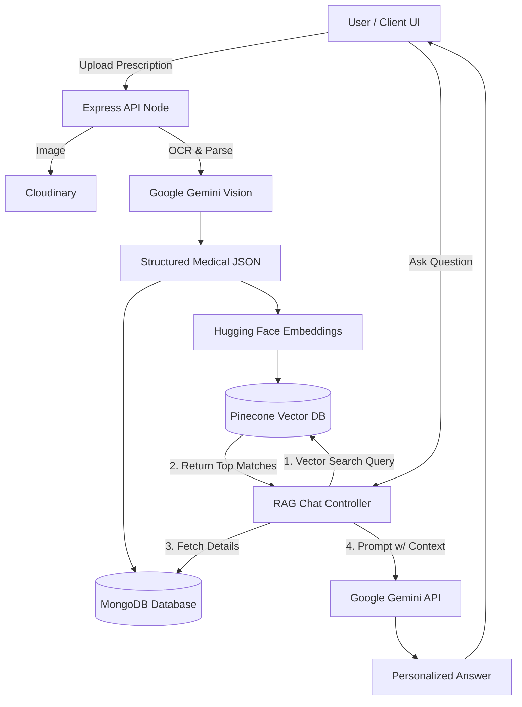

<div align="center">
  
</div>

<div align="center">
  
</div>

<p align="center">
  <a href="#"></a>
  <a href="#"></a>
  <a href="#"></a>
  <a href="#"></a>
  <a href="#"></a>
  <a href="#"></a>
</p>

---

## 🌌 Overview

The **AI-Powered Personal Healthcare Assistant** is a modern, full-stack application bridging the gap between complex medical documents and patient comprehension. By leveraging **Retrieval-Augmented Generation (RAG)**, advanced **OCR**, and **vector similarity search**, this platform digitizes medical histories and provides highly contextual, instant health intelligence.

---

## ✨ Features

- **🔐 Secure Authentication**: Robust JWT & bcrypt-based user verification.
- **📄 AI-Powered OCR**: Automatically uploads (via Cloudinary) and transcribes physical prescriptions using **Gemini Vision**.
- **🧠 Intelligent Parsing**: Structures raw medical text into standardized formats (Medicines, Dosages, Doctor Notes) using **Gemini API**.
- **💾 Dual-Database Architecture**: Stores relational data in **MongoDB** while maintaining high-dimensional embeddings in **Pinecone**.
- **🤖 RAG Healthcare Chatbot**: Have natural conversations with an empathetic AI that "remembers" your exact medical history.
- **🔍 Semantic Search**: Instantly locate past medications or conditions using vector similarity (powered by **Hugging Face** embeddings).
- **📊 Health Insights Dashboard**: Interactive visualizations of your diagnostic history, top doctors, and frequent medications.
- **🚨 Smart Alerts System**: An autonomous background analyzer that detects concerning medical patterns (e.g., frequent antibiotics).
- **🥗 Bio-Gen Diet Synth**: Dynamically generates personalized, safe dietary plans based strictly on your historical prescriptions and health goals.

---

## 🏗️ System Architecture



*(Note: The diagram above illustrates the Retrieval-Augmented Generation pipeline implemented in this project: Upload -> OCR -> Embedding -> Vector Storage -> Contextual Retrieval -> AI Generation).*

---

## 🛠️ Technology Stack

| Category | Technologies |
| :--- | :--- |
| **Frontend** | React.js, Tailwind CSS, Vite, Recharts |
| **Backend** | Node.js, Express.js |
| **Database** | MongoDB, Mongoose |
| **Vector DB** | Pinecone |
| **AI / Machine Learning** | Google Gemini API (Vision & Text), Hugging Face (`all-MiniLM-L6-v2`) |
| **Cloud / Storage** | Cloudinary |
| **Security** | JWT (JSON Web Tokens), bcrypt |

---

## ⚙️ Environment Variables

To run this project, configure the following environment variables in your backend `.env` file:

```env
# Server & Database
PORT=5001
MONGO_URI=your_mongodb_cluster_url
JWT_SECRET=your_jwt_secret_key

# Cloudinary (Image Storage)
CLOUD_NAME=your_cloudinary_name
CLOUD_API_KEY=your_cloudinary_api_key
CLOUD_API_SECRET=your_cloudinary_api_secret

# Google Gemini (AI & OCR)
GEMINI_API_KEY=your_gemini_api_key
GEMINI_MODEL=gemini-2.5-flash

# Pinecone & Hugging Face (Vector Search & Embeddings)
PINECONE_API_KEY=your_pinecone_api_key
PINECONE_INDEX_NAME=healthcare-rag
HF_API_KEY=your_huggingface_api_key
```

---

## 🚀 Installation & Setup

### 1. Clone the Repository
```bash
git clone https://github.com/Sainath91106/AI-Health_Assistant.git
cd AIHealthcare
```

### 2. Backend Initialization
```bash
cd healthcare-ai-backend
npm install
# Ensure your .env is created
npm run dev
```

### 3. Frontend Initialization
Open a new terminal window:
```bash
cd "AIHealthcare Frontend"
npm install
npm run dev
```

---

## 📡 API Endpoint Summary

| Module | Endpoint | Method | Description |
| :--- | :--- | :--- | :--- |
| **Auth** | `/api/auth/register` | `POST` | Register a new user |
| **Auth** | `/api/auth/login` | `POST` | Authenticate and issue JWT |
| **Prescriptions** | `/api/prescriptions/upload` | `POST` | Upload, OCR parse, & vectorize records |
| **Prescriptions** | `/api/prescriptions` | `GET` | Retrieve patient history |
| **Chat** | `/api/chat/message` | `POST` | Interact with the RAG-powered chatbot |
| **Search** | `/api/search` | `POST` | Perform semantic Pinecone queries |
| **Dashboard** | `/api/dashboard` | `GET` | Fetch aggregated biometric / stats |
| **Alerts** | `/api/alerts` | `GET` | Execute pattern-evaluation for warnings |
| **Diet** | `/api/diet/generate` | `POST` | Synthesize customized diet regimens |

---

## 🌍 Deployment

*   **Backend (Render):** Set the build command to `npm install` and start command to `node server.js`. Ensure all environment variables are mapped in the Render dashboard. Update the `VITE_API_BASE_URL` in the frontend before deploying.
*   **Frontend (Vercel):** Connect the GitHub repository directly to Vercel. Vercel will auto-detect Vite and deploy the React build output.

---

## 🔮 Future Improvements

-   **Wearable Integration:** Sync with external step and heart-rate APIs for real-time tracking.
-   **Multi-Lingual Support:** Expand the Gemini prompting architecture to support inclusive, native-language diagnostic readouts.
-   **Exportable Reports:** One-click PDF compilation of health histories for seamless doctor visits.
-   **Automated Reminders:** SMS or Push Notification chron-jobs utilizing Node-Cron and Twilio.

---

<div align="center">
  <p><b>Disclaimer:</b> This AI Assistant is designed for informational and organizational purposes. It is <b>not</b> a replacement for professional medical advice, diagnosis, or treatment.</p>
</div>

<div align="center">
  <i>Architected by <a href="https://github.com/Sainath91106" style="color:#00F3FF;">Sainath</a></i>
</div>
